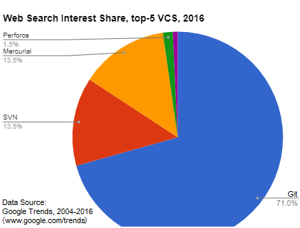

---?image=images/title_bg.png
@title[TITLE]
## Version Control
## For Beginners
> 24th November 2017

---
@title[Hello]

## Presenters

* Katarzyna Siedlarek
* Adam Goldsmith
* Anthony Skidmore

---
@title[Overview]

## Overview

* What is version control? 
* Why use version control?
* What is Git?
* Installing Git
* Working on Git locally
* Working on Git remotely

---
@title[What is Git?]

## What is Git?

* Created by Linus Torvalds 2005
* Etymology - self-proclaimed git!

...*"I'm an egotistical bastard, and I name all my projects after myself. First 'Linux', now 'git'."*

* Written in Perl & C
* Runs on many platforms
* Most popular DVCS

+++
@title[Not Github!]

Git ≠ Github

+++
@title[Git Search History Rank]

Git Search Interest Rank

---
@title[History of VCS]

## History of VCS

+++
@title[1st Gen]

1st Generation
* 1970s
* Single File
* No networking

+++
@title[2nd Gen]

2nd Generation
* Multi File
* Centralised

+++
@title[3rd Gen]

3rd Generation
* Changesets
* Distributed

---
@title[Why use Git?]

## Why use Git?

