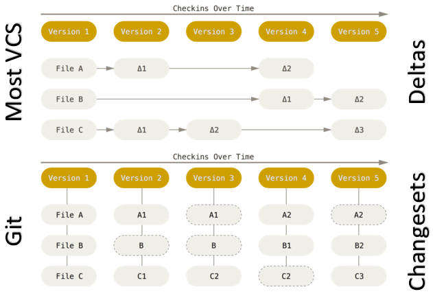

---?image=images/title_bg.png
@title[TITLE]

## An Introduction to
## Version Control
> 24th November 2017

---
@title[Hello]

## Presenters

+++
@title[Kasia]

### Kasia Siedlarek

<figure>

</figure>

+++
@title[Adam]

### Adam Goldsmith


+++
@title[Tony]

### Tony Skidmore


---
@title[Overview]

## Overview

+++
@title[Contents]

- What is version control?
- Why use version control? |
- What is Git? |
- Installing Git |
- Working on Git locally |
- Working on Git remotely |
- Take a look at Innersource |
- Interactive Demo of GitLab |

+++

You can access presentation here: 

https://gitpitch.com/AdamGoldsmith/gitdemo#/

---
@title[What is version control?]

## What is version control?

+++
@title[History of VCS]

#### History of VCS
#### (Version Control Systems)


| 1st Gen       | 2nd Gen     | 3rd Gen     |
|---------------|-------------|-------------|
| 1972          | 1986        | Late 1990s  |
| No networking | Centralised | Distributed |
| Single file   | Multi file  | Changesets  |

+++
@title[Centralised vs Distributed]


+++
@title[Useful references]

### Useful references

[Version Control - Wikipedia](https://en.wikipedia.org/wiki/Version_control)

[History of VCS](https://www.lynda.com/ALMTFS-tutorials/history-version-control/106788/115979-4.html)

---
@title[Why use version control?]

## Why use version control?

+++
@title[How do you track your changes?]

<figure>

</figure>

+++
@title[Bad example 1]

<figure>

</figure>

+++
@title[Bad example 2]

<figure>

</figure>

+++
@title[Bad example 3]

<figure>

<figcaption>source: <a href="https://xkcd.com/">xkcd</a></figcaption>
</figure>
	
---
@title[What is Git?]

## What is Git?

+++
@title[Git is..]


*"I'm an egotistical bastard, and I name all my projects after myself. First 'Linux', now 'git'."*

* Created by Linus Torvalds 2005
* Originally written in Perl & C
* Runs on many platforms
* Most popular VCS

+++
@title[Git is not..]

Git ≠ (GitHub ≈ GitLab ≈ Bitbucket ≈ Innersource ≈ etc)

+++
@title[How Git is different]

#### Difference with Git



[Git Basics](https://git-scm.com/book/en/v2/Getting-Started-Git-Basics)

+++
@title[Git Search History Rank]

Git Search Interest Rank


+++
@title[Useful references]

### Useful references

[A poem about Git written in Git](https://i.redd.it/1v049jyhktmz.jpg)

---
@title[Git installation]
## Git installation

+++
@title[Git installation - Linux]

### Linux
* sudo apt-get install git
* sudo yum install git
* (or build from source)
* [detailed instructions](https://git-scm.com/download/linux)

+++
@title[Git installation - Mac OSX]

### Mac OS X
* [brew](https://brew.sh/) install git
* (or build from source with [macports](https://www.macports.org/))
* [detailed instructions](https://git-scm.com/download/mac)

+++
@title[Git installation - Windows]

### Windows
* download [git](https://git-scm.com/download/windows) and follow interactive installer
* install with [chocolatey](https://chocolatey.org/packages/git)

+++
@title[Git installation - Windows setup - license and path]

##### Windows setup

* Read license ([GNU General Public License](https://www.gnu.org/licenses/#GPL))
* Set up install path (C:\Program Files\Git)

+++
@title[Git installation - Windows setup - components]

##### Windows setup

* Select components:
    * Additional icons
    * Windows Explorer integration (Git Bash Here, Git GUI Here)
    * __Git LFS (Large File Support)__
    * __Associate .git configuration files with the default text editor__
    * __Associate .sh files to be run with Bash__
    * Use TrueType font in all consoles

+++
@title[Git installation - Windows setup - environment]

##### Windows setup

* Select Start Menu Folder (Git)
* Adjusting your [PATH](https://superuser.com/questions/284342/what-are-path-and-other-environment-variables-and-how-can-i-set-or-use-them) environment
    * __Use Git from Git Bash only__
    * Use Git from Windows Command Prompt
    * Use Git and optional Unix tools from Windows Command Prompt

+++
@title[Git installation - Windows setup - HTTPS backend]

##### Windows setup

* Choosing HTTP transport backend
    * Use OpenSSL
    * __Use native Windows Secure Channel library__

+++
@title[Git installation - Windows setup - line endings]

##### Windows setup

<small>_Character for line ending is different for Unix ("\n") and Windows ("\r\n"), read more [here](https://en.wikipedia.org/wiki/Newline)_</small>
* Configuring the line ending conversions
    * __Checkout Windows-style, commit Unix style line endings__
    * Checkout as-is, commit Unix-style line endings
    * Checkout as-is, commit as-is

+++
@title[Git installation - Windows setup - terminal]

##### Windows setup

* Configuring the terminal emulator to use with Git Bash
    * __Use MinTTY__
    * Use Windows’s default console window (cmd)

+++
@title[Git installation - Windows setup - extras]

##### Windows setup

* Extra options:
    * Enable file system caching
    * Enable [Git Credential Manager](https://git-scm.com/book/en/v2/Git-Tools-Credential-Storage)
    * Enable [symbolic links](https://en.wikipedia.org/wiki/Symbolic_link)

+++
@title[Git installation - Windows setup - final]

##### Windows setup
__Install!__

+++
@title[Git installation - Windows setup - demo]

##### Windows setup demo

<iframe src="https://drive.google.com/file/d/1Up28TxJ3xJRXAUQf9LGsUJ5L0xvWOUMc/preview" width="640" height="480"></iframe>

+++
@title[Git installation - Basic git setup - demo]

##### Basic git setup

[](https://asciinema.org/a/148260)

+++
@title[Git installation - links]

### Useful Links

[Git customization](https://git-scm.com/book/en/v2/Customizing-Git-Git-Configuration)

[More windows install options](http://www.jamessturtevant.com/posts/5-Ways-to-install-git-on-Windows/)

---
@title[Working on Git locally]

## Working on Git locally

+++
@title[Different Git Areas]

### Different areas in Git


+++
@title[Useful references]

### Useful references

[Good commit message practices](https://chris.beams.io/posts/git-commit)

---
@title[Working with remote repos]

## Working with remote repos

+++
@title[Working with remote repos - setup]

##### Remote set up
* Create an account
* Generate ssh keys
* Add ssh keys to your account

+++
@title[Working with remote repos - ssh keys]

##### Generating keys

_Using the SSH protocol, you can connect and authenticate to remote servers and services. With SSH keys, you can connect to GitHub/BitBucket/Innersource/... without supplying your username or password at each visit._

[SSH keys - technical overview](https://www.digitalocean.com/community/tutorials/ssh-essentials-working-with-ssh-servers-clients-and-keys)

[SSH keys - explain like I am five](https://www.reddit.com/r/learnprogramming/comments/1enupy/explain_ssh_keys_and_validation_like_im_five/?st=jabdg9iy&sh=f9163439) 


+++
@title[Working with remote repos - generating keys demo]

[](https://asciinema.org/a/148261)

+++
@title[Working with remote repos - detailed instructions]

Detailed instructions on generating ssh keys [here](https://help.github.com/articles/generating-a-new-ssh-key-and-adding-it-to-the-ssh-agent/#platform-windows)

+++
@title[Working with remote repos - adding keys]

##### Adding public key to account keys


+++
@title[Working with remote repos - create repo - demo]

#### Create repo on GitHub
<iframe width="800" height="500" src="https://www.youtube.com/embed/inSe13Au5tg?&vq=hd720?rel=0" frameborder="0" gesture="media" allowfullscreen></iframe>

+++
@title[Working with remote repos - commands]

#### Commands

```bash
# list all remotes connected to your repo
git remote -v
# add new remote to repo
git remote add <name> <url>
# remove remote from repo
git remote rm <name>
# import commits from remote repo
git fetch <remote>
# shows changes between current and selected commit
git diff <commit>
# merges changes
git merge
# push commits to remote repo
git push <remote> <branch>
# same as fetch + merge
git pull <remote>
```

[Git cheatsheat](https://www.atlassian.com/git/tutorials/atlassian-git-cheatsheet)

+++

Place to add some more advanced demo

---
@title[Interactive Demo]

## Interactive Demo

#### Tony Skidmore

---
@title[Closing]

#### Cool observations

* Learnt new Gitty things preparing content
* Presentation created and maintained in Git
* Content produced using [Markdown](https://github.com/adam-p/markdown-here/wiki/Markdown-Cheatsheet) + [GitPitch](https://github.com/gitpitch/gitpitch/wiki) + [asciinema](https://asciinema.org/)
* Get to know new people
* Feels good to collaborate and contribute

+++
@title[Thank you]

## THANK YOU

#### Remember : Version Control is for Everybody

**It is fundamental for DevOps & Infrastructure as Code !**

